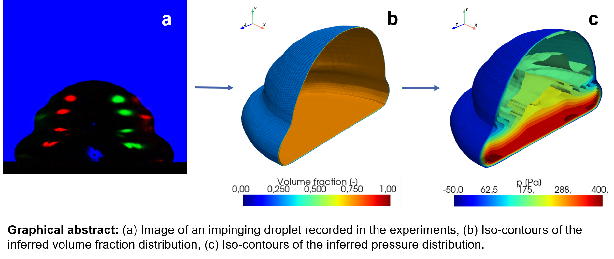

# PINNs4Drops: Video-conditioned physics-informed neural networks for two-phase flow reconstruction

[](https://arxiv.org/abs/2411.15949)

by Maximilian Dreisbach (Institute of Fluid Mechanics (ISTM) - Karlsruhe Institute of Technology (KIT))
and Elham Kiyani (Division of Applied Mathematics - Brown University)

[](https://arxiv.org/abs/2411.15949)

This repository contains the code for training and evalution of video-conditioned physics-informed neural networks (VcPINNs) and image-conditioned PINNs (IcPINNs) as presented 
in our article ["PINNs4Drops: Video-conditioned physics-informed neural networks for two-phase flow reconstruction"](https://arxiv.org/abs/2411.15949).

The datasets used in this work, as well as the weights of the trained PINNs are available on [KITopen](https://doi.org/10.35097/mmnxkbqqeye8p5tx)

If you have any questions regarding this code, please feel free to contact Maximilian (maximilian.dreisbach@kit.edu).

## Requirements
- Python 3 (required packages below)
- PyTorch
- json
- PIL
- skimage
- tqdm
- numpy
- cv2
- matplotlib

for training and data generation
- trimesh with pyembree
- pyexr
- PyOpenGL
- freeglut

## Tested for: 
(see requirements.txt)

## Getting Started
- Create conda environment from requirements.txt (`conda create --name <env> --file requirements.txt`)
- Download pre-processed glare-point shadowgraphy images from [KITopen](https://doi.org/10.35097/mmnxkbqqeye8p5tx)
- OR use processing scripts on own data (see [GPS-Processing GitHub](https://github.com/MaxDreisbach/GPS-Processing))
- Download network weights and move the file to `./PINNs4Drops/VcPINNs/checkpoints/` or `./PINNs4Drops/IcPINNs/checkpoints/`
- OR train the network on new data (see below)
- Run eval.py for volumetric reconstruction (see below)
- Open .obj file of reconstructed interface in Meshlab, Blender, or any 3D visualization software 

## Evaluation
This script reconstructs the 3D gas-liquid interface, as well as the 3D pressure distribution and the three components of the velocity vector for each time step.
For the evaluation of VoF-VcPINNs from `./PINNs4Drops/VcPINNs/`
```python -m apps.eval --name {name of experiment} --test_folder_path {path to processed image data} --dataroot {path to dataset with flow_case.json} --load_netG_checkpoint_path {path to network weights}```

The reconstruction requires for each time step an image in `path_to_processed_image_data` and a `.txt` file containing a decimal number that indicates the physical time.
(Run `python -m apps.extract_timestep_test_data.py` to generate time step labels for new datasets)

The reconstruction results are saved under `./results/name_of_experiment` and contain an `.obj` file representing the 3D gas-liquid interface and `.vtk` files containing the inferred velocity and pressure fields.
Additional plotting 2D slices of the predicted fields maybe be activated in `./lib/train_util/`. Further plotting options can be adjusted in `./lib/plotting/`. \
The resolution of the reconstruction can be controlled with the flag `--resolution {res}`, with a default value of 512.

For the evaluation of PF-VcPINNs run 
`python -m apps.eval_CH2 --name {name of experiment} --test_folder_path {path to processed image data} --dataroot {path to dataset with flow_case.json} --load_netG_checkpoint_path {path to network weights}`

## Data Generation (Linux Only)
The data generation uses codes adapted from PIFu by Saito et al. (2019), see [PIFu GitHub](https://github.com/shunsukesaito/PIFu) for further reference.
The following code should be run with [pyembree](https://github.com/scopatz/pyembree), as it is otherwise very slow. \
The data generation requires `.obj` files of ground truth 3D gas-liquid interfaces, obtained e.g. by numerical simulation. 
First, binary masks, placeholder renderings, and calibration matrices are computed from the specified `.obj` files.
Then, physically-based rendering in Blender is used to generate realistic synthetic images resembling the recordings from the experiments.

1. The following script precomputes spherical harmonic coefficients for rendering. Adjust the path to the `.obj` files in `prt_util_batch.py`.
```
python -m apps.prt_util_batch
```
2. The following script creates renderings, masks, and calibration matrices representing the relative orientation of the renderings and 3D geometries. The files are saved in newly created folders named `GEO`, `RENDER`, `MASK`, `PARAM`, `UV_RENDER`, `UV_MASK`, `UV_NORMAL`, and `UV_POS` under the specified training data path. Adjust the path to the `.obj` files in `render_data_batch.py`.
```
python -m apps.render_data_batch
```
3. Run the synthetic training data generation in Blender (see [Render-GPS GitHub](https://github.com/MaxDreisbach/RenderGPS))
4. Copy the renderings from the Blender output folder into the `RENDER` folder
5. The following script extracts ground truth labels for the velocity components and pressure from the results of numerical simulation and saves them in an appropriate format for training the PINNs. The domain limits and resolution of the numerical simulation need to be adapted. The code was written for simulations in the computational fluid dynamics (CFD) software OpenFOAM, but might serve as a reference for the extraction of suitable labels from other CFD software.
```
python -m apps.export_vel_pres
```
6. The following script extracts labels for the time step from the results of numerical simulation.
```
python -m apps.extract_timestep_dataset
```

## Training (Linux Only)
The following code should be run with [pyembree](https://github.com/scopatz/pyembree), as it is otherwise very slow. 

Run the following script to train the VOF-PINNs. The intermediate checkpoints are saved under `./checkpoints`. You can add `--n_data` and `--n_residual` flags to adjust the number of sampling points for the data loss and residual loss calculation based on available GPU memory. The flags `--random_scale` and `--random_trans` enable data augmentation and perform random scaling and random cropping with translation of the input images. The options for the weights of the different loss terms and other hyperparameters can be set in `./lib/options/` and can be added as flags.
```
python -m apps.train_shape --dataroot {path_to_training_data} --name {name_of_the_model} --random_scale --random_trans
```


If you find the code useful in your research, please consider citing the paper.

```
@misc{Dreisbach2024PINNs4Drops,
    title={{PINNs4Drops}: Convolutional feature-enhanced physics-informed neural networks for reconstructing two-phase flows}, 
    author={Maximilian Dreisbach and Elham Kiyani and Jochen Kriegseis and George Karniadakis and Alexander Stroh},
    year={2024},
    eprint={2411.15949},
    archivePrefix={arXiv},
    primaryClass={physics.flu-dyn},
    url={https://arxiv.org/abs/2411.15949}, 
    note={\href{https://arxiv.org/abs/2411.15949}{arXiv:2411.15949}}
}
```

## Related Research
- This code is based on "PIFu: Pixel-Aligned Implicit Function for High-Resolution Clothed Human Digitization" by Saito et al. (2019) \
(see https://github.com/shunsukesaito/PIFu)
- "Physics-informed neural networks for phase-field method in two-phase flow" Qiu et al. (2022)
- "Inferring incompressible two-phase flow fields from the interface motion using physics-informed neural networks" Buhendwa et al. (2021)
